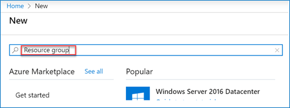
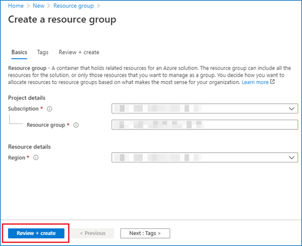
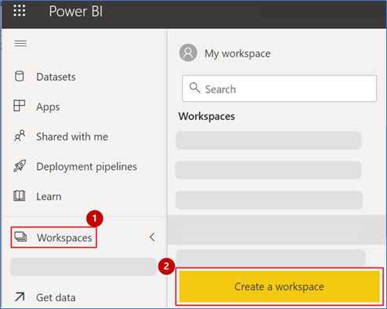
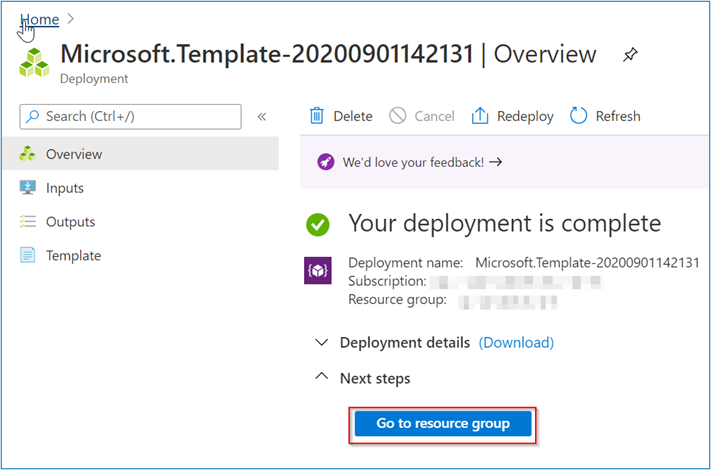
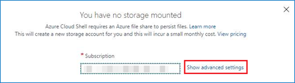

# OpenAI DREAM PoC Accelerator Setup Guide

## What is it?
DREAM PoC Accelerator (DPoC) are packaged Industry Scenario DREAM Demos with ARM templates (with a demo web app, Power BI reports, Azure OpenAI services, AML Notebooks etc.) that can be deployed in a customer’s subscription using the CAPE tool in a few hours.  Partners can also deploy DREAM Demos in their own subscriptions using DPoC.

## Objective & Intent
Partners can deploy DREAM Demos in their own Azure subscriptions and show live demos to customers. 
In partnership with Microsoft sellers, partners can deploy the industry scenario DREAM demos into customer subscriptions. 
Customers can play,  get hands-on experience navigating through the demo environment in their own subscription and show to their own stakeholders.

## Getting Started

> **IMPORTANT:** In order to deploy and run this example, you'll need an **Azure subscription with access enabled for the Azure OpenAI service**. You can request access [here](https://aka.ms/oaiapply). You can also visit [here](https://azure.microsoft.com/free/cognitive-search/) to get some free Azure credits to get you started.

> **AZURE RESOURCE COSTS** by default this sample will create Azure App Service and Azure Cognitive Search resources that have a monthly cost, as well as Form Recognizer resource that has cost per document page. 


## :exclamation:IMPORTANT NOTES:  

  1. **Please read the [license agreement](https://github.com/microsoft/Azure-Analytics-and-AI-Engagement/blob/main/CDP-Retail/license.md) and [disclaimer](https://github.com/microsoft/Azure-Analytics-and-AI-Engagement/blob/main/CDP-Retail/disclaimer.md) before proceeding, as your access to and use of the code made available hereunder is subject to the terms and conditions made available therein.** Any third party tool used in the demo is not owned by us and you will have to buy the licenses for extended use.
  2. Without limiting the terms of the [license](https://github.com/microsoft/Azure-Analytics-and-AI-Engagement/blob/main/CDP-Retail/license.md) , any Partner distribution of the Software (whether directly or indirectly) may only be made through Microsoft’s Customer Acceleration Portal for Engagements (“CAPE”). CAPE is accessible by Microsoft employees. For more information about the CAPE process, please connect with your local Data & AI specialist or CSA/GBB.
  3. Please note that **Azure hosting costs** are involved when DREAM Demos in a Box are implemented in customer or partner Azure subscriptions. **Microsoft will not cover** DPoC hosting costs for partners or customers.
  4. Since this is a DPoC, there are certain resources open to the public. **Please ensure proper security practices are followed before you add any sensitive data into the environment.** To strengthen the security posture of the environment, **leverage Azure Security Centre.** 
  5.  For any questions or comments please email **[dreamdemos@microsoft.com](mailto:dreamdemos@microsoft.com).**
  
   > **Note**: Set up your demo environment at least two hours before your scheduled demo to make sure everything is working.
   
# Copyright - 2023

© 2023 Microsoft Corporation. All rights reserved.   

By using this demo/lab, you agree to the following terms: 

The technology/functionality described in this demo/lab is provided by Microsoft Corporation for purposes of obtaining your feedback and to provide you with a learning experience. You may only use the demo/lab to evaluate such technology features and functionality and provide feedback to Microsoft.  You may not use it for any other purpose. You may not modify, copy, distribute, transmit, display, perform, reproduce, publish, license, create derivative works from, transfer, or sell this demo/lab or any portion thereof. 

COPYING OR REPRODUCTION OF THE DEMO/LAB (OR ANY PORTION OF IT) TO ANY OTHER SERVER OR LOCATION FOR FURTHER REPRODUCTION OR REDISTRIBUTION IS EXPRESSLY PROHIBITED. 

THIS DEMO/LAB PROVIDES CERTAIN SOFTWARE TECHNOLOGY/PRODUCT FEATURES AND FUNCTIONALITY, INCLUDING POTENTIAL NEW FEATURES AND CONCEPTS, IN A SIMULATED ENVIRONMENT WITHOUT COMPLEX SET-UP OR INSTALLATION FOR THE PURPOSE DESCRIBED ABOVE. THE TECHNOLOGY/CONCEPTS REPRESENTED IN THIS DEMO/LAB MAY NOT REPRESENT FULL FEATURE FUNCTIONALITY AND MAY NOT WORK THE WAY A FINAL VERSION MAY WORK. WE ALSO MAY NOT RELEASE A FINAL VERSION OF SUCH FEATURES OR CONCEPTS.  YOUR EXPERIENCE WITH USING SUCH FEATURES AND FUNCITONALITY IN A PHYSICAL ENVIRONMENT MAY ALSO BE DIFFERENT.

# DISCLAIMER

This presentation, demonstration, and demonstration model are for informational purposes only and (1) are not subject to SOC 1 and SOC 2 compliance audits, and (2) are not designed, intended or made available as a medical device(s) or as a substitute for professional medical advice, diagnosis, treatment or judgment. Microsoft makes no warranties, express or implied, in this presentation, demonstration, and demonstration model. Nothing in this presentation, demonstration, or demonstration model modifies any of the terms and conditions of Microsoft’s written and signed agreements. This is not an offer and applicable terms and the information provided are subject to revision and may be changed at any time by Microsoft.

This presentation, demonstration, and demonstration model do not give you or your organization any license to any patents, trademarks, copyrights, or other intellectual property covering the subject matter in this presentation, demonstration, and demonstration model.

The information contained in this presentation, demonstration and demonstration model represents the current view of Microsoft on the issues discussed as of the date of presentation and/or demonstration, for the duration of your access to the demonstration model. Because Microsoft must respond to changing market conditions, it should not be interpreted to be a commitment on the part of Microsoft, and Microsoft cannot guarantee the accuracy of any information presented after the date of presentation and/or demonstration and for the duration of your access to the demonstration model.

No Microsoft technology, nor any of its component technologies, including the demonstration model, is intended or made available as a substitute for the professional advice, opinion, or judgment of (1) a certified financial services professional, or (2) a certified medical professional. Partners or customers are responsible for ensuring the regulatory compliance of any solution they build using Microsoft technologies.

----

## Licensing

This repository is licensed under the [MIT License](LICENSE.md).

The data set under the /data folder is licensed under the [CDLA-Permissive-2 License](CDLA-Permissive-2.md).

----

## Contents

<!-- TOC -->

- [Requirements](#requirements)
- [Before Starting](#before-starting)
  - [Task 1: Create a resource group in Azure](#task-1-create-a-resource-group-in-azure)
  - [Task 2: Power BI Workspace creation](#task-2-power-bi-workspace-creation)
  - [Task 3: Deploy the ARM Template](#task-3-deploy-the-arm-template)
  - [Task 4: Run the Cloud Shell to provision the demo resources](#task-4-run-the-cloud-shell-to-provision-the-demo-resources)
  - [Task 5: Running the subscripts](#task-5-running-the-subscripts)
  
<!-- /TOC -->

## Requirements

* An Azure account with the ability to create Azure OpenAI Service.
* A Power BI Pro or Premium account to host Power BI reports.
* Make sure you are the Power BI administrator for your account and service principal access is enabled on your Power BI tenant.
* Make sure the following resource providers are registered with your Azure Subscription.
   - Microsoft.AzureOpenAI
   - Microsoft.CognitiveServices
   - Microsoft.SearchServices
   - Microsoft.FormRecognizer
* You can run only one deployment at any point in time and need to wait for its completion. You should not run multiple deployments in parallel as that will cause deployment failures.
* Select a region where the desired Azure Services are available. If certain services are not available, deployment may fail. See [Azure Services Global Availability](https://azure.microsoft.com/en-us/global-infrastructure/services/?products=all) for understanding target service availability. (consider the region availability for Synapse workspace, Iot Central and cognitive services while choosing a location)
* Do not use any special characters or uppercase letters in the environment code. Also, do not re-use your environment code.
* In this Accelerator we have converted real-time reports into static reports for the ease of users but have covered entire process to configure real-time dataset. Using those real-time dataset you can create real-time reports.
* Please ensure that you select the correct resource group name. We have given a sample name which may need to be changed should any resource group with the same name already exist in your subscription.
* The audience for this document is CSAs and GBBs.
* Please log in to Azure and Power BI using the same credentials.
* Once the resources have been set up, please ensure that your AD user and Synapse workspace have “Storage Blob Data Owner” role assigned on storage account name starting with “stopenai...”. You need to contact AD admin to get this done.
* Please review the [License Agreement](https://github.com/microsoft/Azure-Analytics-and-AI-Engagement/blob/main/CDP-Retail/license.md) before proceeding.

## Before starting

### Task 1: Create a resource group in Azure

1. **Log into** the [Azure Portal](https://portal.azure.com) using your Azure credentials.

2. On the Azure Portal home screen, **select** the '+ Create a resource' tile.

	

3. In the Search the Marketplace text box, **type** "Resource Group" and **press** the Enter key.

	

4. **Select** the 'Create' button on the 'Resource Group' overview page.

	
	
5. On the 'Create a resource group' screen, **select** your desired subscription. For Resource group, **type** 'rg-openai-dpoc'. 

6. **Select** your desired region.

	> **Note:** Some services behave differently in different regions and may break some part of the setup. Choosing one of the following regions is preferable: 		eastus, eastus2.

7. **Click** the 'Review + Create' button.

	

8. **Click** the 'Create' button once all entries have been validated.

	

### Task 2: Power BI Workspace creation

1. **Open** Power BI in a new tab using the following link:  [https://app.powerbi.com/](https://app.powerbi.com/)

2. **Sign in**, to Power BI using your Power BI Pro account.

	

	> **Note:** Use the same credentials for Power BI which you will be using for the Azure account.

3. In Power BI service, **click** on 'Workspaces'.

4. Then, **click** on the 'Create a workspace' tab.

	

	> **Note:** Please create a workspace by the name "DPoC-OpenAI".

5. **Copy** the workspace GUID or ID. You can get this by browsing to [https://app.powerbi.com/](https://app.powerbi.com/), selecting the workspace, and then copying the GUID from the address URL.

6. **Paste** the GUID in a notepad for future reference.

	

	> **Note:** This workspace ID will be used during the ARM template deployment.	

### Task 3: Deploy the ARM Template.

1. **Open** this link in a new tab of the same browser that you are currently in: 
	
	
	<a href='https://portal.azure.com/#create/Microsoft.Template/uri/https%3A%2F%2Fraw.githubusercontent.com%2Fmicrosoft%2FAzure-Analytics-and-AI-Engagement%2Fazure-openai%2Fopenai%2Fmain-template.json' target='_blank'></a>

2. On the Custom deployment form, **select** your desired subscription.

3. **Select** the resource group name **rg-openai-dpoc** which you created in [Task 1](#task-1-create-a-resource-group-in-azure).

4. **Provide/Type** an environment code which is unique to your environment. This code is a suffix to your environment and should not have any special characters or uppercase letters and should not be more than 6 characters. 

5. **Enter** the Power BI workspace ID copied in step 6 of [Task 2](#task-2-power-bi-workspace-creation).

6. **Click** ‘Review + Create’ button.

	

7. **Click** the **Create** button once the template has been validated.

	
	
	> **NOTE:** The provisioning of your deployment resources will take approximately 5 minutes.
	
8. **Stay** on the same page and wait for the deployment to complete.
    
	
    
9. **Select** the **Go to resource group** button once your deployment is complete.

	

### Task 4: Run the Cloud Shell to provision the demo resources

1. **Open** the Azure Portal. In the Resource group section, **open** the Azure Cloud Shell by selecting its icon from the top toolbar.

	

2. **Click** on 'Show advanced settings'.

	

	> **Note:** If you already have a storage mounted for Cloud Shell, you will not get this prompt. In that case, skip step 2 and 3.

3. **Select** your 'Resource Group' and **enter** the 'Storage account' and 'File share' name.

	

	> **Note:** If you are creating a new storage account, give it a unique name with no special characters or uppercase letters.

4. In the Azure Cloud Shell window, ensure the PowerShell environment is selected.

5. **Enter** the following command to clone the repository files.

Command:
```
git clone -b azure-openai --depth 1 --single-branch https://github.com/microsoft/Azure-Analytics-and-AI-Engagement.git openAI
```


	
> **Note:** If you get 'File already exists' error, please execute the following command to delete existing clone: 

```
rm openai -r -f 
```

> **Note**: When executing scripts, it is important to let them run to completion. Some tasks may take longer than others to run. When a script completes execution, you will be returned to a command prompt. 

10. **Execute** the openaiSetup.ps1 script by executing the following command:

```
cd ./openAI/openai
```

11. Then **run** the PowerShell: 
```
./openaiSetup.ps1
```
    


12. You will see the below screen, **enter** 'Y' and **press** the enter key.

	
      
13. From the Azure Cloud Shell, **copy** the authentication code

14. Click on the link [https://microsoft.com/devicelogin](https://microsoft.com/devicelogin) and a new browser window will launch.

	
     
15. **Paste** the authentication code and **click** on Next.

	

16. **Select** the same user that you used for signing in to the Azure Portal in [Task 1](#task-1-create-a-resource-group-in-azure).

	
	
17. In the below screen **click** on continue.

	

18. **Close** the browser tab once you see the message window at right and **go back** to your Azure Cloud Shell execution window.

	
	
19. You will see the below screen and perform step #9 to step #13 again.

	

20. Now you will be prompted to select subscription if you have multiple subscriptions assigned to the user you used for device login.

    
	
	> **Notes:**
	> - The user with single subscription won't be prompted to select subscription.
	> - The subscription highlighted in yellow will be selected by default if you do not enter any disired subscription. Please select the subscription carefully, as it may break the execution further.
	> - While you are waiting for processes to get completed in the Azure Cloud Shell window, you'll be asked to enter the code three times. This is necessary for performing installation of various Azure Services and preloading content in the Azure Synapse Analytics SQL Pool tables.

21. You will be asked to confirm for the subscription, **enter** 'Y' and **press** the enter key.

	

22. You will now be prompted to **enter** the resource group name in the Azure Cloud Shell. **Type** the same resource group name that you created in [Task 1](#task-1-create-a-resource-group-in-azure). – 'rg-openai-dpoc'.

	

23. You will now be asked to confirm for the installation for necessary package, **enter** 'A' and **press** the enter key.

	

24. After the complete script has been executed, you get to see the message "--Execution Complete--"

	> **Note:** 
	>- If you get any error while the execution of the script, we have subscripts available for each section in particular.
	>- Only move to Task 5 if you encounter any error during the execution of the script.
	>- For example : The screenshot below with the error message you see below, is for the knowledge base training section.


### Task 5: Running the subscripts

1. Make sure you are in the path as given below:

```
	./openAI/openai/subscripts
```
2. Run the function app subscript which you need to execute.

> **Note:** Example path ./func_campaign_generation.ps1


3. Steps for executing the script are same as [Task 4](#task-4-run-the-cloud-shell-to-provision-the-demo-resources) step 6 onwards.

